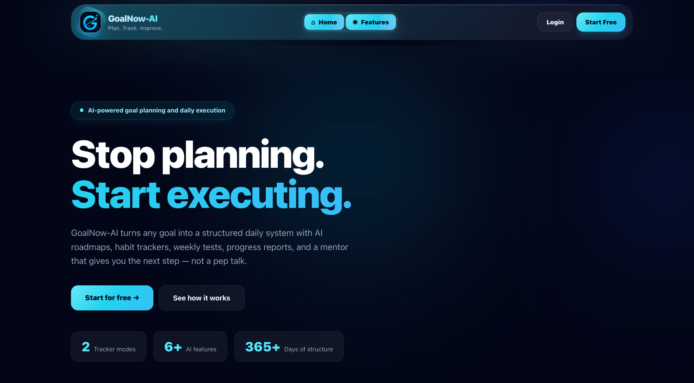
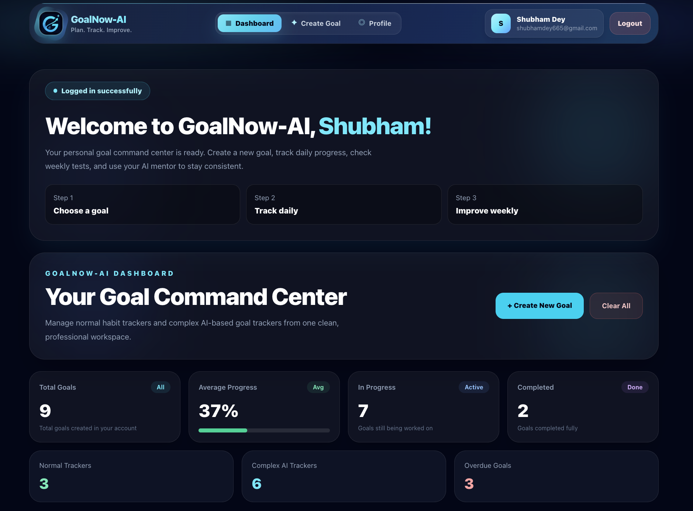
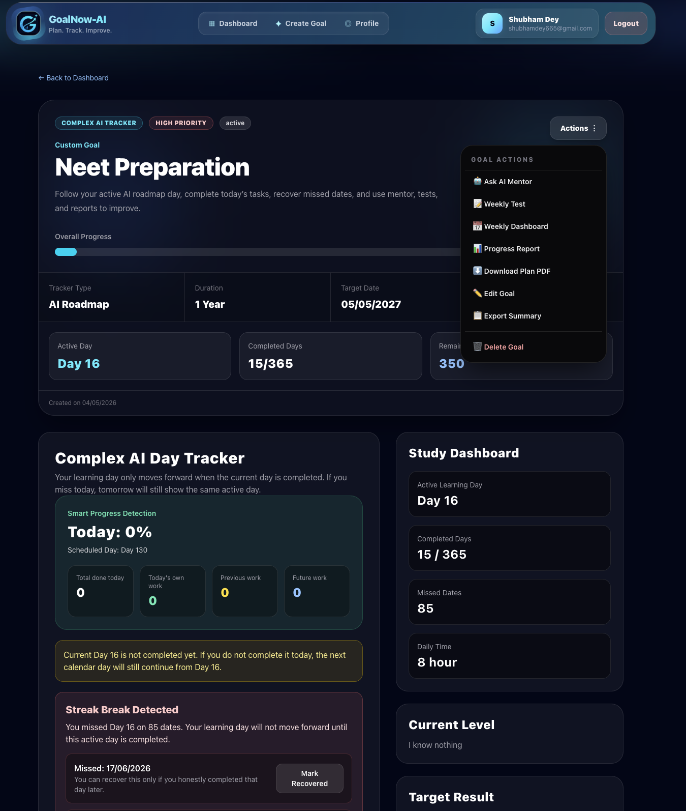

<div align="center">


# GoalNow-AI

### Plan with clarity. Show up daily. Improve every week.

[](https://goalnow-ai.vercel.app/)
[](https://nextjs.org/)
[](https://www.typescriptlang.org/)
[](https://supabase.com/)


[Explore the live app](https://goalnow-ai.vercel.app/) · [Report an issue](https://github.com/shubhamDeyCoder/GoalNow-AI/issues) · [Request a feature](https://github.com/shubhamDeyCoder/GoalNow-AI/issues)

</div>

## Product preview

<p align="center">
  
</p>

<p align="center">
  
  
</p>

---

## What is GoalNow-AI?

GoalNow-AI helps bridge the gap between setting ambitious goals and following through every day. It supports lightweight habit tracking and structured long-term plans, then brings daily progress, weekly reviews, and focused mentor-style guidance into one workspace.

> **The idea:** a goal should feel like a next action, not a vague promise.

## Highlights

| | Feature | What it helps with |
|:--:|---|---|
| 🎯 | **Two tracking modes** | Choose a simple habit tracker or a detailed long-term goal plan. |
| 📅 | **Daily execution** | Break a goal into practical work and keep today’s task visible. |
| 📊 | **Progress reports** | Review completion, consistency, skipped days, and momentum. |
| 🧠 | **AI mentor space** | Get concise, goal-focused guidance when you are stuck or miss a day. |
| 📝 | **Weekly reviews and quizzes** | Reflect on your progress and reinforce learning goals. |
| 🔐 | **Account-based data** | Sign up, sign in, and keep goal data associated with your account. |

## Built for real goals

Whether your target is interview preparation, fitness, language learning, an exam, or mastering full-stack development, GoalNow-AI helps convert the big outcome into repeatable work.

```text
Choose a goal → create a plan → complete today’s task
       ↓                 ↓                 ↓
   stay focused     track progress    review & improve
```

## Product status

| Area | Status |
|---|:---:|
| Landing page and dashboard | ✅ Available |
| Normal and complex trackers | ✅ Available |
| Authentication and goal storage | ✅ Available |
| Create, edit, and delete goals | ✅ Available |
| Mentor, weekly test, and report pages | ✅ Available |
| Professional PDF export | 🚧 In progress |
| Full language switching and analytics | 🗺️ Planned |

## Tech stack

| Layer | Technology |
|---|---|
| App framework | Next.js + React |
| Language | TypeScript |
| Styling | Tailwind CSS |
| Authentication & database | Supabase |
| Hosting | Vercel |

## Run it locally

### Prerequisites

- Node.js 20 or newer
- npm
- A Supabase project

### 1. Clone and install

```bash
git clone https://github.com/shubhamDeyCoder/GoalNow-AI.git
cd GoalNow-AI
npm install
```

### 2. Configure environment variables

Copy the example file and enter your Supabase project values:

```bash
cp .env.example .env.local
```

```env
NEXT_PUBLIC_SUPABASE_URL=your_supabase_project_url
NEXT_PUBLIC_SUPABASE_ANON_KEY=your_supabase_anon_key
```

> Never commit `.env.local`. The Supabase anonymous key is designed to be exposed in browser applications; secure user data with Row Level Security (RLS) policies in your Supabase project. Never expose a Supabase service-role key in client-side code.

### 3. Start developing

```bash
npm run dev
```

Open [http://localhost:3000](http://localhost:3000).

## Scripts

| Command | Purpose |
|---|---|
| `npm run dev` | Start the local development server |
| `npm run build` | Create a production build |
| `npm run start` | Run the production build locally |
| `npm run lint` | Run configured lint checks |

## Roadmap

- [ ] Finish professional PDF exports
- [ ] Improve plan scalability and task-history reporting
- [ ] Store mentor-message and weekly-test history
- [ ] Add actionable analytics and stronger empty states
- [ ] Improve the small-screen dashboard experience
- [ ] Add complete English, Bengali, and Hindi support

## Contributing

Ideas, bug reports, and pull requests are welcome.

1. Fork the repository.
2. Create a focused branch: `git checkout -b feat/short-description`.
3. Make your change and run `npm run lint`.
4. Open a pull request explaining the problem and solution.

## License

Distributed under the [MIT License](./LICENSE).

## Author

Built by [Shubham Dey](https://github.com/shubhamDeyCoder) — a full-stack developer focused on practical products, strong fundamentals, and steady progress.

<div align="center">

### If GoalNow-AI helps you move forward, consider giving it a star.

**Plan · Track · Improve**

</div>
